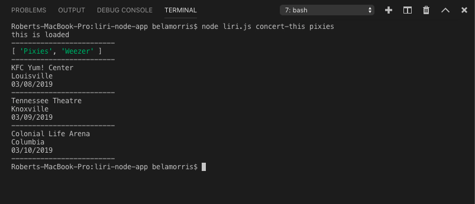
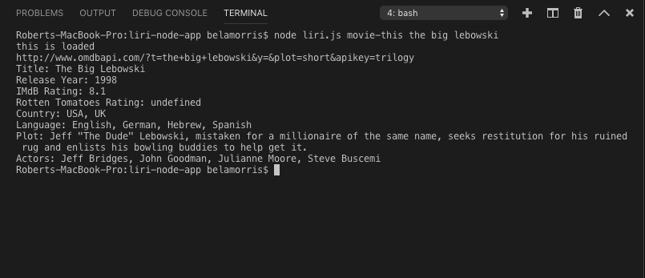
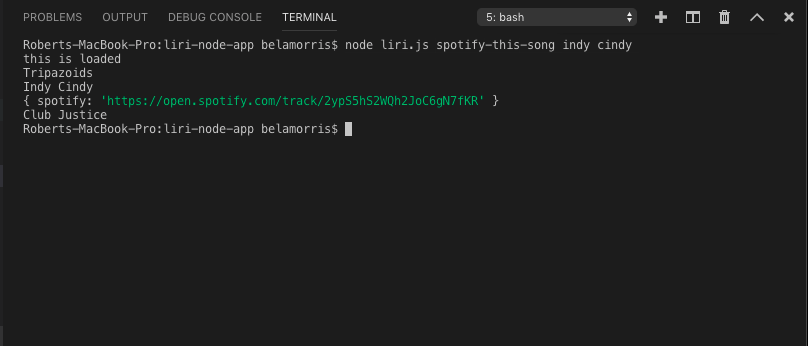
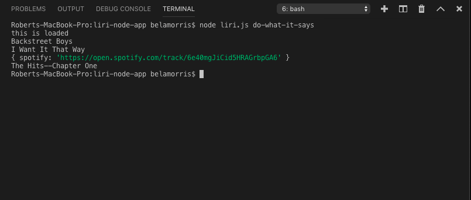

# Robert Morris
Full Stack Developer

Group Project 2
Look Alike - Find Your Doppelganger - Photo Comparison Matching Application

The Task
The task was to implement Node JS, Express JS, and a MySQL database using an ORM within a MVC paradigm to create an application employing servers to run the app as a website.

Site Overview
This single page style site presents the user with concise instructions and an intuitive interface. The user is asked to enter their name and an image URL. After this information is entered, they simply hit the button titled "Doppelganger Me" and the user's photo is compared against a set of stored photos to find that which has the highest confidence match. As the search commences, the user is shown the image, name, and confidence match of each comparison run. Once the comparison matching process is complete, an alert appears indicating that a best match was found. When the user clicks on the "Ok" button in the alert, their best match appears along with the confidence level of the match, presented as Best Match %. The bottom, left-hand side of the screen shows a count indicator that provides information regarding how many clients are currently on the site. User information input into the site is saved in the database.

Run App Through Heroku Deployement
Try the App.

Getting Started on Your Own Machine
Clone repo to your machine.

Navigate to the Project2 directory on your maching using GitBash or your terminal.

Enter 'npm install' in GitBash or your terminal.

This will install the proper js package files from a package JSON file.
The schema_photolibaries_local.sql and seeds_photolibraries_local.sql files are provided so that you may create the database and table as well as seed the table with values for initial application use.

Running on a Local Server
Enter 'node server.js' this will open a local server on your machine.
Your terminal will display which port the app is using, in this case 3000.
Open up a browser window and type in 'localhost:3000', this will open the homepage for Look Alike - Find Your Doppelganger
User Actions:
Enter First Name.
Enter Image URL.
Press button titled "Doppelganger Me" to begin image matching process.
Tech Employed
Node.js - (see below)
Express.js - https://www.npmjs.com/package/express
Sequelize - https://www.npmjs.com/package/sequelize
MySQL2 - https://www.npmjs.com/package/mysql2
Path.js - https://www.npmjs.com/package/path
JQuery - https://jquery.com/
Handlebars - http://handlebarsjs.com/
Express-Handlebars - https://www.npmjs.com/package/express-handlebars
Socket.io - https://www.npmjs.com/package/socket.io
Materialize - https://materializecss.com/
ESLint - https://eslint.org/
JawsDB MySQL - add on available on heroku
Prerequisites
Node.js - The latest version of Node is available at: https://nodejs.org/en/
Built With
VS Code - Text Editor

Authored and Maintained By:
Dennis Ries
Robert Morris
Cole Hilgers
Contact: dtries@gmail.com

# liri-node-app
LIRI Bot
LIRI is like iPhone's SIRI, however, while SIRI is a Speech Interpretation and Recognition Interface, LIRI is a Language Interpretation and Recognition Interface. LIRI is be a command line node app that takes in on of four parameters and returns the relative data.
concert-this spotify-this-song movie-this do-what-it-says

Deployment
Clone repo
Run npm install
At command prompt run node liri.js <pass in an instruction from above>

Screenshot of the concert-this command

Screenshot of the movie-this

Screenshot of spotify-this-song

Screenshot of do-what-it-says

Technologies Utilized
NodeJS
JavaScript
Spotify API
bandsintown API
OMDB API
NPM simple-node-logger
NPM spotify-web-api-node
NPM dotenv
NPM moment

Adventure Advisors
Find out live information regarding trips you wish to take!
Pulling from Weather and Google Map APIs
Generate live weather and traffic feeds based on query searches.
Live Site: {https://raynamcginnis.github.io/group-project-1/} Created by Autumn, Rayna, Robert, and Thomas

TriviaGame
In this quiz you will see how much you know about rockets youll have 10 seconds for each question at the end you'll be able to see how well you did This project is usefull because it demonstrates how to make a trivia game using jquery, css, and html.

Music Wars
In this RPG game you will see which genre of music is best choose your character then you will have to face the remaining three characters choose wisely This project is usefull because it demonstrates how to make a simple game using jquery, css, and html.
